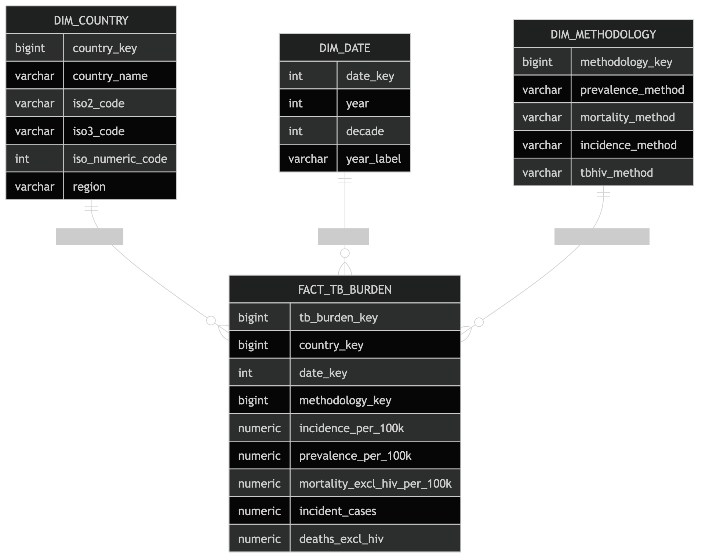

# TB Burden Reporting Analytics

**Author:** Seif H. Kungulio\
**Focus:** Reporting Data Analytics • Data Engineering • Dimensional
Modeling\
**Tools:** PostgreSQL, R, RMarkdown, SQL, DBI, RPostgres

------------------------------------------------------------------------

## Project Overview

Modern public health analysis relies on the ability to convert complex
datasets into structured reporting systems that support evidence-based
decision making. This project demonstrates how global tuberculosis (TB)
burden data can be transformed into a production-style analytical
reporting database using PostgreSQL and dimensional modeling.

Starting from a raw epidemiological dataset containing country-level TB
metrics across multiple decades, the project builds an end-to-end
analytics pipeline that:

-   Ingests and preserves raw data
-   Cleans and standardizes analytical fields
-   Implements a star schema data warehouse
-   Creates performance-optimized reporting views
-   Enables trend analysis, benchmarking, and regional comparisons

The final result is a scalable reporting model designed for analytics
teams, business intelligence dashboards, and public health monitoring
systems.

------------------------------------------------------------------------

## Business & Analytical Value

This project demonstrates how data engineering and reporting analytics
techniques can transform raw public health data into decision-ready
insights.

Key analytical capabilities include:

-   Tracking TB incidence, prevalence, and mortality trends over time
-   Comparing disease burden across countries and world regions
-   Identifying countries with the highest TB case counts
-   Monitoring case detection performance and reporting gaps
-   Supporting longitudinal public health analysis across decades

By structuring the data into a dimensional reporting model, the project
allows analysts and BI tools to perform fast aggregations and
interactive exploration of global health indicators.

------------------------------------------------------------------------

## Dataset

**Source Dataset:** Global TB Burden Country Dataset

The dataset contains country-level annual measurements including:

  | Metric Category | Examples |
  | ----------------| --------------------------------------------------------
  | Population      | Estimated total population |
  | Prevalence      | TB prevalence per 100k population |
  | Incidence       | Incident TB cases |
  | Mortality       | TB deaths (excluding HIV and HIV-positive cases) |
  | HIV-TB          | Incidence and mortality among HIV-positive populations |
  | Detection       | Case detection rate (%) |

The dataset contains 47 variables per record and was validated prior to
ingestion to ensure schema compatibility and data integrity.

------------------------------------------------------------------------

## Architecture

The analytical warehouse follows a star schema design, enabling
efficient reporting queries and simplified joins.

### Star Schema Structure

------------------------------------------------------------------------

## Data Engineering Pipeline

The project implements a multi-layer data pipeline commonly used in
enterprise analytics environments.

### 1. Raw Ingestion Layer

Raw CSV data is loaded directly into PostgreSQL without modification.

Purpose:

-   Preserve original source data
-   Enable traceability and auditing

Table:

tb_reporting.raw_tb_burden_country

------------------------------------------------------------------------

### 2. Cleaned Staging Layer

Data is standardized and validated.

Key transformations include:

-   Trim whitespace
-   Convert blank values to NULL
-   Cast numeric fields
-   Standardize column names
-   Validate analytical grain

Table:

tb_reporting.stg_tb_burden_country_clean

------------------------------------------------------------------------

### 3. Dimensional Warehouse Layer

Cleaned data is transformed into a star schema:

-   dim_country
-   dim_date
-   dim_methodology
-   fact_tb_burden

This structure supports efficient analytical queries and reporting
dashboards.

------------------------------------------------------------------------

## Data Quality & Validation

Several validation checks ensure data reliability.

### Row Count Reconciliation

  | Table         | Row Count |
  |---------------| ----------|
  | Raw dataset   | 5,120 |
  | Staging layer | 5,120 |
  | Fact table    | 5,120 |

No records were lost during transformation.

------------------------------------------------------------------------

### Grain Integrity

The dataset was validated to ensure:

**1 record per country per year**

Duplicate checks confirmed no duplicate country-year records.

------------------------------------------------------------------------

## Performance Optimization

Indexes were created on frequently queried columns to improve query
performance.

Examples include:

-   idx_dim_country_name
-   idx_dim_country_region
-   idx_fact_tb_country_key
-   idx_fact_tb_date_key
-   idx_fact_tb_country_date

These indexes accelerate filtering, joins, and time-series queries used
in reporting dashboards.

------------------------------------------------------------------------

## Reporting Views

Two analytical views simplify reporting queries.

### Country-Year Reporting View

vw_tb_country_year_report

Provides a flattened dataset combining fact and dimension tables, making
it easier for BI tools and analysts to access reporting metrics.

------------------------------------------------------------------------

### Regional Summary View

vw_tb_region_year_summary

Provides pre-aggregated metrics including:

-   Total population
-   Total incident cases
-   Total deaths
-   Regional averages

This structure supports high-level monitoring dashboards.

------------------------------------------------------------------------

## Example Analytical Queries

### Country Trend Analysis

The reporting model enables longitudinal analysis of TB metrics for a
country across time.

Example: India TB trends from 1990--2013 including:

-   Incidence per 100k
-   Case detection rate
-   TB mortality

------------------------------------------------------------------------

### Top Countries by TB Incidence

Example ranking query identifies countries with the highest TB burden.

Top countries in 2013:

  Rank   Country   Cases
  ------ --------- --------
  1      India     \~2.1M
  2      China     \~980K
  3      Nigeria   \~590K

------------------------------------------------------------------------

## Key Skills Demonstrated

This project demonstrates competencies required in Reporting Analyst,
Data Analyst, and Analytics Engineer roles.

### Data Engineering

-   ETL pipeline development
-   Raw → staging → warehouse architecture
-   SQL data transformations
-   PostgreSQL schema design

### Data Modeling

-   Dimensional modeling
-   Star schema design
-   Fact and dimension tables
-   Analytical grain enforcement

### Data Quality

-   Validation checks
-   Duplicate detection
-   Missing value auditing
-   Row reconciliation

### Reporting Analytics

-   Analytical SQL queries
-   Aggregation and ranking analysis
-   Regional benchmarking
-   Trend analysis

------------------------------------------------------------------------

## Tools & Technologies

  | Category              | Tools |
  |-----------------------| ----------------|
  | Database              | PostgreSQL |
  | Language              | SQL |
  | Analytics Environment | R |
  | Integration           | DBI, RPostgres |
  | Data Processing       | dplyr |
  | Documentation         | RMarkdown |

------------------------------------------------------------------------

